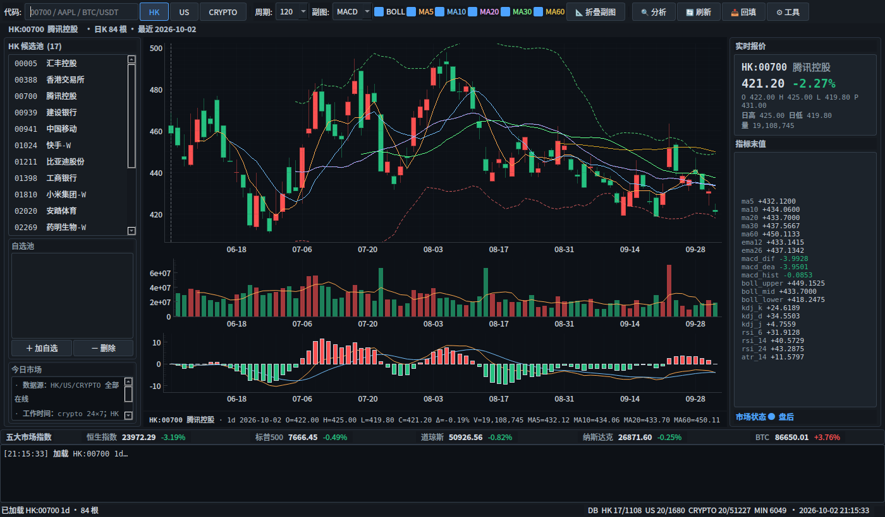
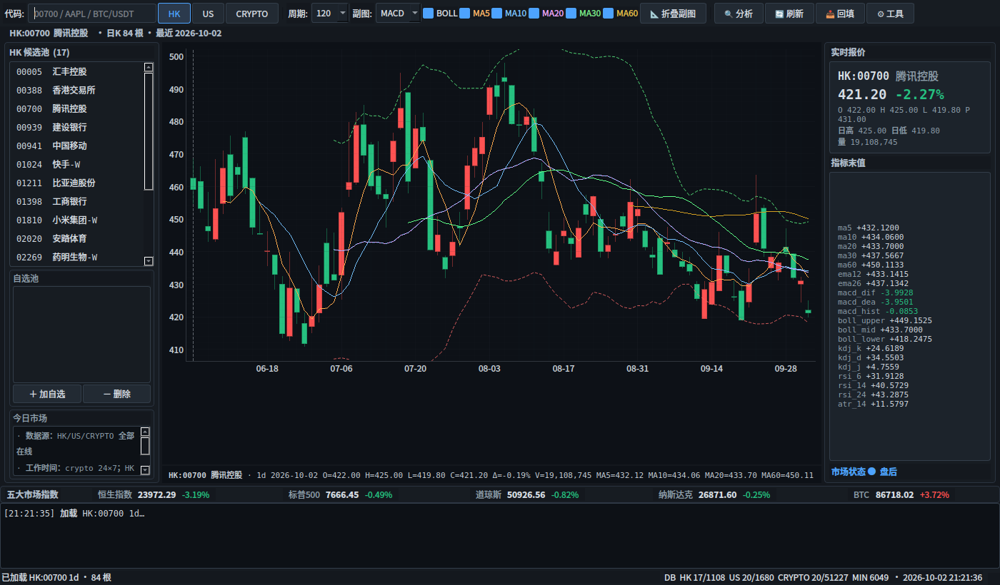

# market-sniper

> 港 / 美 / 加密 / A股 短线研究工具：多市场 K 线统一查看 + 向量化指标 + PyQt6 桌面 GUI。
> 
> 主题、布局（顶部工具栏 / 暗色密集三联图 / 五大指数条 / 底部日志）参考 stock_predict。



## 功能

- **四市场统一**：HK 港股 / US 美股 / CRYPTO 加密 / CN A股
- **多周期**：日 K + 1m/5m/15m/30m/1h 分钟K
- **指标**（TDX 口径 numpy 向量化）：
  - MA / EMA / BOLL / MACD / KDJ / RSI / ATR
  - DMI / ADX / OBV / CCI / 涨跌天数 / 动量 / 波动率
- **GUI**（PyQt6 + pyqtgraph，沿用 stock_predict 暗色密集布局）：
  - 工具栏：市场 / 代码 / 周期 / 副图 (MACD/KDJ/RSI/ADX/量比) / BOLL / MA5-60 / 折叠副图
  - 信息行：标的简介 / 加载进度 / 悬停信息
  - 主体：自选池（左） / K线三联图（中） / 实时报价 + 指标末值（右）
  - 五大市场指数条（恒生 / 标普 / 道指 / 纳指 / BTC）
  - 底部日志



## 数据源

| 市场     | 日K          | 分钟K           | 代码形态           |
| ----------- | --------------- | ----------------- | ------------------- |
| HK       | yfinance | yfinance | `HK:00700` |
| US       | yfinance | yfinance | `US:AAPL` |
| CRYPTO   | ccxt (Binance/OKX/Bybit) | ccxt | `CRYPTO:BTC/USDT` |
| CN       | yfinance (SH/SZ) | yfinance | `CN:sh600000` |

- yfinance 通过直接调用 Yahoo Finance v8 chart endpoint 实现（绕开 yfinance Ticker
  触发 quoteSummary 404 的问题，参考 [yfinance](https://github.com/ranaroussi/yfinance)
  仓库中 HK 标的的兼容性 bug）。
- ccxt 默认走 Binance，Binance 失败时降级 OKX → Bybit → Gate。

## 安装

```bash
pip install -r requirements.txt
```

依赖：`ccxt / yfinance / numpy / pandas / requests / PyQt6 / pyqtgraph`。

> 需要 Python 3.10+；本项目开发在 Python 3.14。如果系统 python 是 3.10+ 且用 venv：
> ```bash
> python3 -m venv .venv
> source .venv/bin/activate
> pip install -r requirements.txt
> ```

## 快速开始

```bash
# 1. 先把默认候选池（HK 17 / US 20 / Crypto 20）回填最近 120 天日 K
python main.py --backfill

# 2. 启动 GUI（双击桌面快捷方式亦可）
python main.py
# 或：/home/lan/桌面/market-sniper/run.sh
```

**首次启动**会主动拉取默认标的。工具栏的「回填」可批量回填整个候选池。

## 用法

### CLI 回填

```bash
# 单市场 / 单标的
python -m market_sniper.data.backfill --market HK --days 365
python -m market_sniper.data.backfill --symbols HK:00700,US:AAPL --days 365
python -m market_sniper.data.backfill --market CRYPTO --period max   # 全历史
python -m market_sniper.data.backfill --minute 1m                     # 1 分钟 K
python -m market_sniper.data.backfill --force                        # 忽略本地最新日期强制重拉
```

### Python 内嵌

```python
from market_sniper.data import fetcher, db

# 回填 BTC 日 K 全历史
fetcher.backfill_daily("CRYPTO:BTC/USDT", period="max")

# 拉 1 分钟 K（默认 7d）
fetcher.backfill_minute("HK:00700", timeframe="1m", period="7d")

# 读本地库
bars = db.load_daily_bars("CRYPTO", "BTC/USDT")
print(bars["close"][-3:])

# 算指标
from market_sniper import indicators as ind
ins = ind.compute(bars)
print(ind.last_values(ins, ["ma20", "macd_dif", "rsi_14"]))
```

## 目录结构

```
market-sniper/
├── main.py                # 入口（GUI / --backfill / --health）
├── run.sh                 # 桌面快捷方式指向的启动脚本
├── market_sniper/
│   ├── __init__.py
│   ├── symbols.py         # 四市场代码互转
│   ├── indicators.py      # TDX 风格向量化指标
│   ├── data/
│   │   ├── db.py          # SQLite schema + load/upsert
│   │   ├── http.py        # 熔断器 + 代理路由（备用）
│   │   ├── fetcher.py     # 统一 fetcher（按市场路由 + 入库）
│   │   ├── backfill.py    # CLI 回填
│   │   └── sources/
│   │       ├── yfinance_us.py   # yahoo chart endpoint
│   │       ├── ccxt_crypto.py   # ccxt multi-exchange
│   │       └── tencent_cn.py    # A 股（包装 yfinance）
│   └── gui/
│       ├── kline_widget.py      # PyQtGraph 蜡烛 + 副图
│       └── main_window.py       # 主窗口
├── scripts/
│   └── screenshot.py      # 截图脚本（无 GUI 验证）
├── data/                  # SQLite 缓存（market_cache.db）
├── docs/                  # 截图
├── requirements.txt
└── README.md
```

## 数据存放

- 默认库：`data/market_cache.db`（SQLite WAL）
- 表：
  - `stocks(market, code, name, exchange, ...)` 元信息
  - `daily_bars(market, code, date, OHLCV, source)` 日 K，UNIQUE(market,code,date)
  - `min_bars(market, code, timeframe, ts, OHLCV, source)` 分钟 K
  - `meta(key, value, ts)` 配置 / 上次拉取时间
- 覆盖路径：环境变量 `MARKET_SNIPER_DB=/path/to.db`

## 已知限制

- **历史分钟 K**：
  - yfinance 1m 限 7 天，5m/15m/30m 限 60 天，1h 限 730 天
  - ccxt（Binance）历史分钟 K 完整，但需分页拉取，量大时慢
- **A 股**：暂用 yfinance 拉 SH/SZ，BJ 北交所尚未支持
- **数据准确性**：yfinance 数据有 15 分钟延迟（非 pro 账户）；A 股不复权
- **复权**：A 股暂未实现复权因子（todo v0.2 接 stock_predict 的新浪复权思路）

## License

仅供研究学习，不构成投资建议。