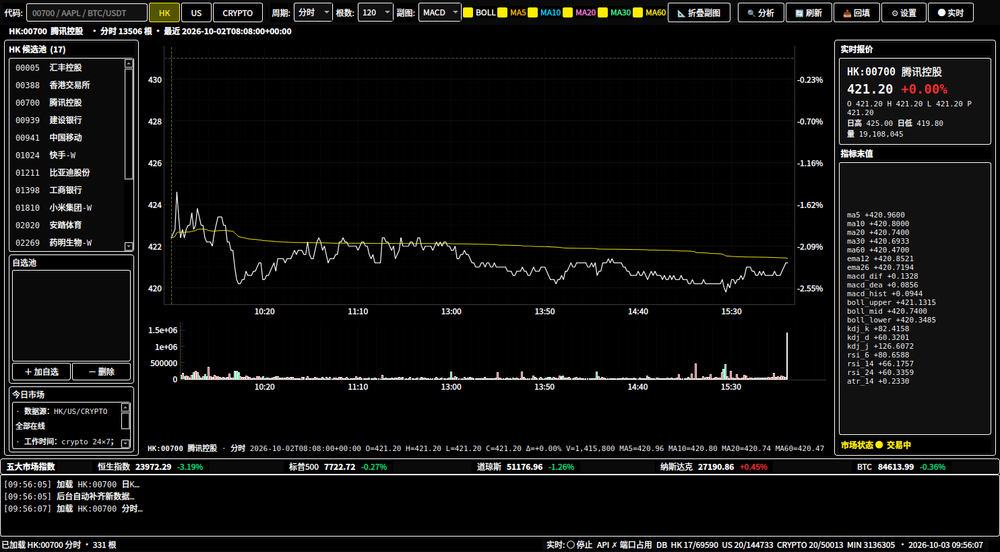
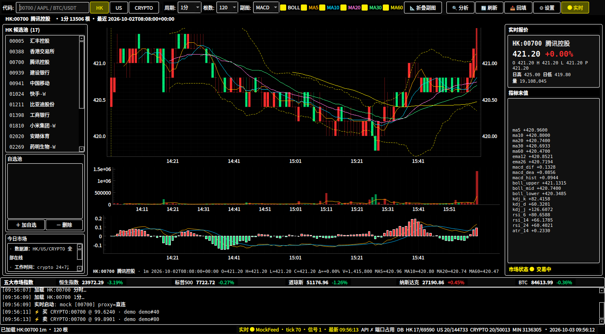

# market-sniper

> 港 / 美 / 加密 **超短线研究 + 实时交易框架**：多市场 K 线、分时图、实时引擎、
> 仓位语义信号、标准回测、本地 API + 浏览器插件。
> UI 风格参考 stock_predict（高对比暗色主题）。


## 三件套架构

```
┌────────────────────┐   WS 实时行情    ┌──────────────┐
│  客户端 (PyQt6)     │ ←────────────── │  Binance     │
│  · K线/分时/指标    │                 └──────────────┘
│  · 实时引擎+策略    │── 计算转发 ───→  ┌──────────────┐
│  · 本地 HTTP API    │                │  compute/    │  ← 可单独部署
│    127.0.0.1:7132  │←── JSON ──────  │  (计算端)    │
└─────────┬──────────┘                 └──────────────┘
          │ 买卖点
┌─────────▼──────────┐
│  浏览器插件 (MV3)   │  TradingView / Binance / Yahoo / 雪球 / 长桥
└────────────────────┘
```

- **客户端**：PyQt6 桌面程序。数据层（SQLite）、实时引擎、GUI、API、计算转发都在这里。
- **计算端**：`compute/` 下的自包含脚本（仅依赖 numpy），stdin/stdout JSON，
  可脱离主程序单独跑、单独部署；信号与回测共用同一转发协议。
- **插件**：只做标的识别 + 信号展示，计算全在本地客户端，不向任何外部服务器发数据。

## 功能

- **三市场统一**：HK 港股 / US 美股 / CRYPTO 加密，代码形态 `HK:00700` / `US:AAPL` / `CRYPTO:BTC/USDT`
- **周期**：分时（价格线+均价线+昨收基准+右轴百分比）/ 1m / 5m / 15m / 30m / 60m / 日K
- **指标**（numpy 向量化）：MA / EMA / BOLL / MACD / KDJ / RSI / ATR / DMI / ADX / OBV / CCI / 量比
- **实时引擎**：Binance WebSocket 组合流（逐笔 aggTrade + 1s K线 + 盘口 bookTicker），
  断线指数退避重连；事件总线 → 策略 → 信号 → K线买卖点叠加；离线 Mock 源联调
- **信号是仓位动作**（非独立 BS 点）：美股/加密 `开多 / 平多 / 开空 / 平空`，HK `买 / 卖`（只多）
- **标准回测**：下一根开盘成交 + 手续费/滑点 + 全仓，HK 只多 / US+CRYPTO 可空；
  收益/年化/Sharpe/回撤/胜率/盈亏比
- **启动自动补齐**：每次打开程序后台增量拉新（日K接续 + 分钟K刷新）
- **数据源可配置**：设置面板选交易所（Binance/OKX/Bybit/Gate），代理热生效



## 快速开始

```bash
# 依赖：Python 3.10+（Linux 优先）
pip install -r requirements.txt      # 或用 release 包里的 install.sh

# 首次回填（三市场候选池，日K全历史 + 分钟K）
python main.py --backfill

# 启动 GUI（首次需在 ⚙ 设置里确认代理，默认 127.0.0.1:7890）
./run.sh
```

打开程序后台会自动补齐新数据；「📥 回填」对话框可按代码（分号分隔）+ 根数 + 周期定向拉取。

## 实时引擎与策略接口

工具栏「● 实时」启动引擎（数据源在 ⚙ 设置里选 Binance / Mock）。
策略继承 `market_sniper/engine/strategy.py` 的 `Strategy`，在 `on_tick / on_bar`
里返回 `Signal` 即触发买卖点：

```python
from market_sniper.engine import Strategy, Signal

class MyStrategy(Strategy):
    name = "my"

    def on_tick(self, tick):            # tick: 逐笔成交（aggTrade）
        ...
        return Signal(tick.market, tick.code, tick.ts_ms,
                      side="open_long", price=tick.price, strategy=self.name)
```

信号 side 语义（展示元数据见 `signals.ACTION_META`）：

| 市场 | 动作 | K线标记 |
|---|---|---|
| US / CRYPTO | `open_long` 开多 / `close_long` 平多 / `open_short` 开空 / `close_short` 平空 | 实心▲红 / 空心▽绿 / 实心▼绿 / 空心△红 |
| HK（只多） | `buy` 买 / `sell` 卖 | ▲红 / ▼绿 |

逐笔落盘走 `ticks` 表 + 批量 writer（feed 回调内禁止直接写 SQLite）。

## 信号算法与计算转发层

信号与回测共用 `market_sniper/compute.py` 这一层，两种接入方式二选一：

1. **进程内快路径**：在 `market_sniper/signals.py` 写同签名函数并注册
   `SIGNAL_ALGOS["my_algo"] = my_algo`
2. **转发慢路径**：把自包含脚本扔进 `compute/`（stdin JSON → stdout JSON），
   无需注册即可被 `/api/signal`、CLI、回测调用

```bash
python -m market_sniper.compute list                                  # 可用脚本
python -m market_sniper.compute signals --code HK:00700 --tf 1d       # 信号
python -m market_sniper.compute backtest --code US:AAPL --tf 1d       # 回测报告
```

内置示例算法 `boll_atr`：BOLL 下/上轨回归 + 仓位状态机 + ATR 止损参考。

## 标准回测

引擎在 `compute/backtest.py`（自包含）。模型约定：

- 信号在**下一根 K 线开盘价**成交（无未来函数），开盘价加滑点
- 手续费双边 `fee_bps`、滑点 `slippage_bps`、全仓 `position_pct`
- HK 只做多；US / CRYPTO 可做空；逐 bar 净值 + 强制收尾平仓

输出：区间/年化收益、Sharpe、最大回撤、胜率、盈亏比、平均持有、仓位暴露、交易明细、净值曲线。

## 本地 API（随 GUI 启动，仅绑 127.0.0.1）

| 端点 | 说明 |
|---|---|
| `GET /api/health` | 存活检查 |
| `GET /api/symbols` | 三市场标的池 |
| `GET /api/signal?code=HK:00700&tf=1d&algo=boll_atr` | 信号（code 支持无前缀自动识别） |
| `GET /api/backtest?code=BTC/USDT&tf=60m&bars=1500` | 回测（走计算转发层） |

端口 `config.api.port`（默认 7132），设置面板可改、热重启。

## 浏览器插件（extension/，MV3）

开着客户端时，在行情网站的 K 线页面上叠加买卖点浮层
（动作 + 价格 + 现价偏离 + 止损参考 + 当前仓位 + 最近信号）：

| 网站 | 标的识别 |
|---|---|
| TradingView | URL `?symbol=` 参数 |
| Binance | `/trade/BTC_USDT` |
| Yahoo 财经 | `/quote/AAPL` |
| 雪球 | `/S/00700` |
| 长桥证券 | `/stock/00700-HK`、`/trade/HK.00700` |

安装：`chrome://extensions` → 开发者模式 → 加载已解压的扩展程序 → 选 `extension/`。
A股/新加坡会明确提示不支持。



## 数据层

- SQLite（WAL）：`stocks` / `daily_bars` / `min_bars` / `ticks` / `meta`，
  路径默认 `data/market_cache.db`（`MARKET_SNIPER_DB` 可覆盖）
- 设置持久化 `data/settings.json`（`market_sniper/config.py`，`get_config()` 单例）

```jsonc
{
  "network":  { "proxy_enabled": true, "proxy_host": "127.0.0.1", "proxy_port": 7890 },
  "sources":  { "HK": "yfinance", "US": "yfinance", "CRYPTO": "binance" },
  "feed":     { "backend": "binance", "symbols": ["BTC/USDT"], "persist_ticks": false },
  "backfill": { "on_start": true, "days": 30 },
  "api":      { "port": 7132 },
  "strategy": { "enabled": false, "params": {} }
}
```

## 数据源与已知限制

| 市场 | 日K | 分钟K | 备注 |
|---|---|---|---|
| HK | yfinance 全历史 | 1m 限 7d / 5m~30m 限 60d / 60m 限 730d | 免费源延迟约 15 分钟 |
| US | yfinance 全历史 | 同上 | 免费源延迟约 15 分钟 |
| CRYPTO | ccxt 全历史（分页） | ccxt 各档 1000 根 | 实时 WS 免费无上限 |

- Yahoo `range=max` 会降采样，程序内已改走显式起止区间（勿直接调 Yahoo 原生参数）
- 实时 WS 需代理可达 Binance；无代理环境会被 reset
- 不支持 A股（CN 已移除，不要加回来）

## License

[MIT](LICENSE) © 2026 Languangxun

仅供研究学习，不构成投资建议。
